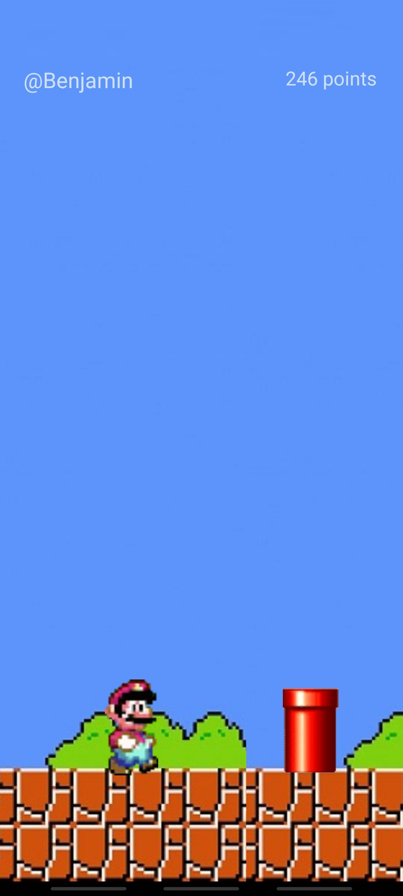

<h1 align="center"> Jumper Android 👋</h1>

> Jumper est un jeu d'arcade avec boucle de jeu infini ! Sautez tant que vous le pouvez !

### 🏠 [Homepage](https://github.com/B3njaminV/)

## 📍 Prérequis

- Android Studio (API16)

## 🖱️ Téléchargement

&nbsp;&nbsp;&nbsp;&nbsp;&nbsp;&nbsp;&nbsp;&nbsp;&nbsp;&nbsp;&nbsp;&nbsp;&nbsp;&nbsp;**Jumper est en cours de publication sur le** [Play Store](https://play.google.com/store)

## 🖼️ Screenshots

| Fenêtre de départ | Fenêtre de jeu | Fenêtre de fin |
|-------------- | --------------| -------------- |
|  |  |  |

## ✍️ Auteur

👤 **VALLEIX Benjamin**

* Github: [@B3njaminV](https://github.com/B3njaminV)
* LinkedIn: [@Benjamin VALLEIX](https://www.linkedin.com/in/benjamin-valleix-27115719a)

## 📝 License

Copyright © 2022

## 🛠  Languages

    
	

